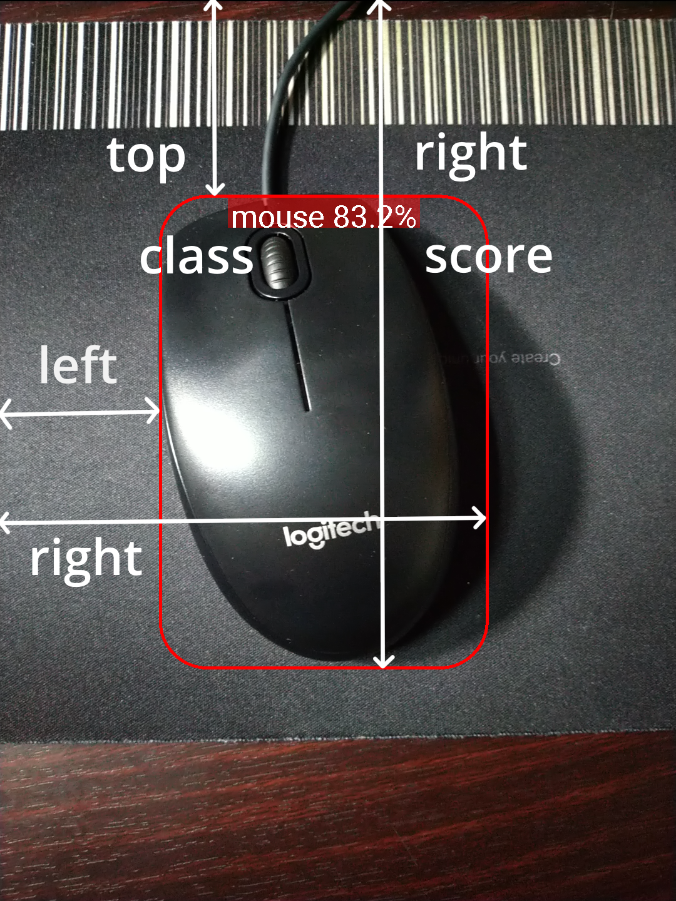

# GCI-Object-Detector
An Object Dtection App using TFLite for Google Code-in

## Project Files Explaination

#### MainActivity
Where things are declared and started.
#### CameraPreview
This manages the preview of camera and passes it to the detector.
#### ObjectDetector
Receives frames from the preview and run TFLite model. Finally, pass all recognitions to the processor.
#### ObjectProcessor

#### Recognition

## Model

 model name | input shape | quantized | model size |
|:-:|:-:|:-:|:-:|
 [COCO SSD MobileNet v1](http://download.tensorflow.org/models/object_detection/ssd_mobilenet_v1_coco_2018_01_28.tar.gz) | 1 x 300 x 300 x 3 | True | 27 Mb |

You can download the model [here](http://download.tensorflow.org/models/object_detection/ssd_mobilenet_v1_coco_2018_01_28.tar.gz).  After you extract it, there should be two files, **detect.tflite** and **labelmap.txt**. **detect.tflite** is where the model is stored. **labelmap.txt** contains all the classes the model can detect.  

### Input

The model takes an image as input which is **300 x 300** pixels with three channels per pixel. As the model is **quantized**, each value is a between **0** and **255**.

### Output

The output contains **class**, **score** and **location**.

#### score (confidence)

Score, which can also be called as confidence, shows how sure about the result the model is.

#### location

Location indicates which box the object is inside and is represented by four values:

<strong>[   top,    left,    bottom,    right   ]</strong>

you can assume that they are equals to:
 

<strong>[   x1,    y1,    x2,    y2   ]</strong>

